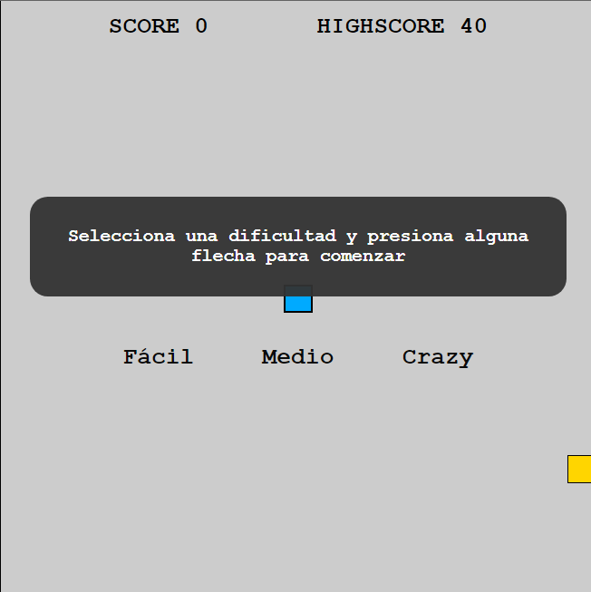
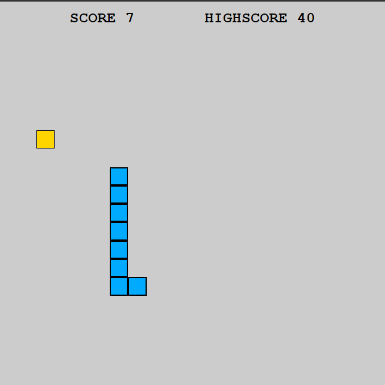

# Snake

Este proyecto es una reversión del clásico juego de la "viborita", con una interfaz simple pero completamente funcional, realizado con vanilla Javascript, CSS puro, y HTML. Entre sus features posee un selector de 3 niveles de dificultad, con diferentes velocidades iniciales, crecimiento de la víbora y aumentos de velocidad según transcurre el juego. Además, guarda en localStorage el puntaje máximo alcanzado.

This project is a reversion of the classic snake game, with a simple but fully functional interface, made with vanilla Javascript, pure CSS, and HTML. Among its features it has a selector of 3 levels of difficult, with different initial speeds, growth of the snake and speed increases as the game progresses. In addition, it saves the maximum score reached in localStorage.

Podes echarte unas partidas acá / You can play here 😉😉😉: <a  href="https://elgramofono.vercel.app/"  target="_blank"  rel="noopener">Snake</a>
